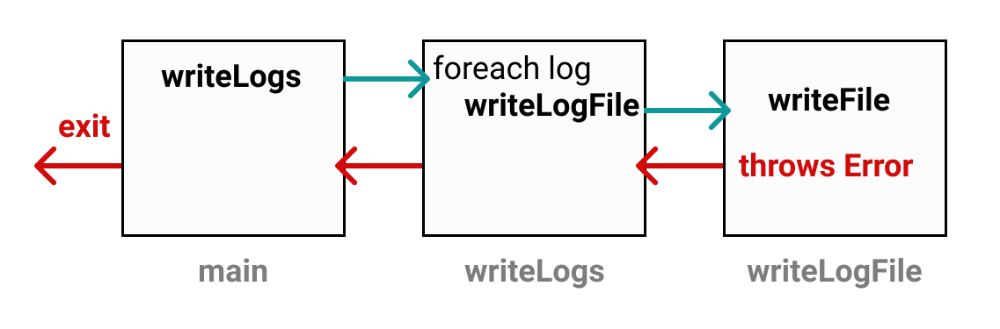

#   EXCEPTIONS 3: Return Error

##  Catch & Return

When an error is thrown, it stops execution and returns execution to the line where the error is caught.

Let's say we have a function `main` which calls `writeLogs` which then calls `writeLogFile`:

```
function writeLogFile(id, contents) {
    // writes a log file to our file system
    writeFile(`logs/${id}`, contents);
}
```

If `writeFile` throws an error, it will completely exit the program if we don't catch it somewhere.

<p >  </p>

Instead, we can catch the error and return `false` from `writeLogFile` if the error is thrown. This way, `writeLogs` can continue writing the rest of the log files.

```
function writeLogFile(id, contents) {
    try {
        writeFile(`logs/${id}`, contents);
    }
    catch(ex) {
        return false;
    }
    return true;
}
```

Now our `writeLogFile` indicates if it was able to write the file if it returns `true`. If it was unable to write the file, it returns `false`. Our `writeLogFile` can determine what to do from there.

>   ✅ It's important to know which methods may throw errors. Then you'll need to decide where you want to catch those errors based on the behavior you expect in your code!

##  🏁 Your Goal: Return in our Function

Modify `catchError` to **return the error** if one is thrown.

If no error is thrown, return `false`.

## CodeBase

-   [catchError.js](catchError.js)
-   [index.js](index.js)
-   [test.js](test.js)

## Run start and test

```
npm run test
```

```
npm run start
```

## issues

-   [test.js](test.js)
