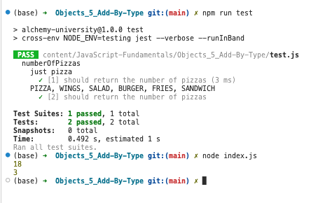

#   OBJECTS - 5: Add By Type

-   [OBJECTS - 5: Add By Type](https://university.alchemy.com/course/js/sc/5d955d0e09d5ed335cbf098b/stage/5d9d037109d5ed335cbf09b5)

##  Importing Files

It's time to **import** our first file! Let's import the `ORDER_TYPES` we just created into `numberOfPizzas.js`.

We can use `require` to pull in the exports from `orderType.js`:

```
const ORDER_TYPES = require('./orderTypes');
```

>   👀 Notice that there are now **three** file tabs. In this exercise we'll be modifying `numberOfPizzas.js`

##  🏁 Your Goal: Add Up Only Pizza Orders

Modify the `numberOfPizzas` function to only count `pizzas` when the `order.type` is equal to `ORDER_TYPES.PIZZA`.

The orders will have a `type` keyword:

```
const orders = [
    { pizzas: 3, type: ORDER_TYPES.PIZZA },
    { wings: 12, type: ORDER_TYPES.WINGS },
];
```

☝️ In this example we would only sum up pizzas from the first order!

```
const totalPizzas = numberOfPizzas(orders);
console.log( totalPizzas ); // 3
```

## CodeBase

-   [orderTypes.js](orderTypes.js)
-   [numberOfPizzas.js](numberOfPizzas.js)
-   [index.js](index.js)
-   [test.js](test.js)

## Run start and test

- run test
```
npm run test
```

- run start
```
npm run start
```

<details>
  <summary> start and test picture capture </summary>

---

<p align="center" >  </p>

---

</details>

